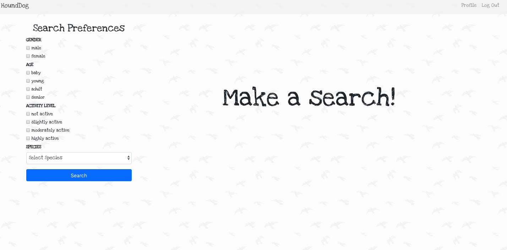
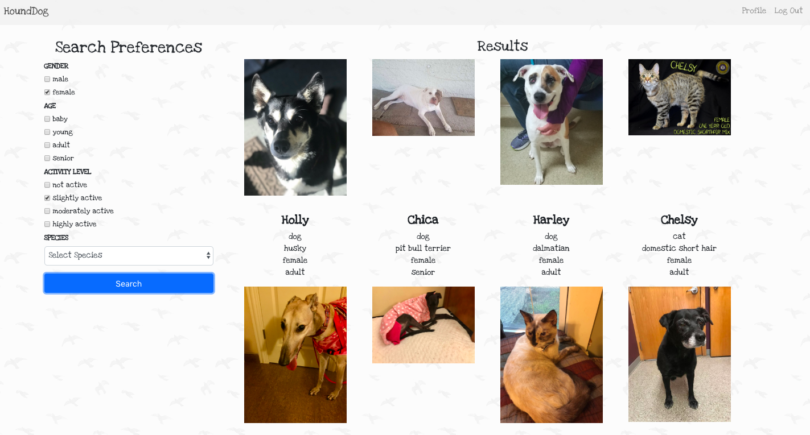
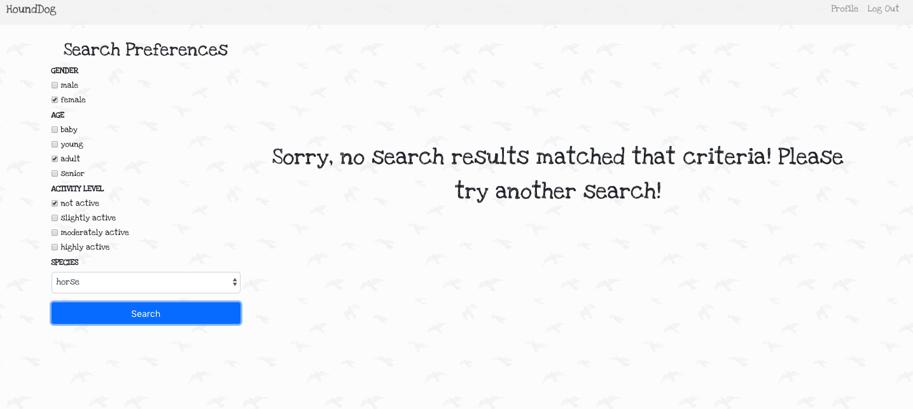
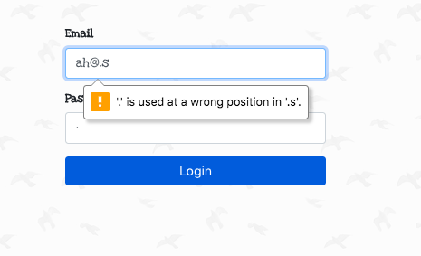

# Welcome to HoundDog!

HoundDog is a starter full-stack project that I created to learn React, JavaScript, Flask, Python, and SQLAlchemy. It allows users to sign up and search for pets that are in animal shelters based on a variety of search criteria such as species, age, gender, and more!

### Technologies
Python, SQLAlchemy, PostgresSQL, Flask, JavaScript, React, HTML/CSS

**External APIs**
RescueGroups, Yelp, Google Maps

### Functionality

Users can sign up for an account and fill in their search preferences. 

Once they are logged in they can search for pets based on a variety of features.

Later when they want to come back, they can log in.

Thanks for visiting!

### Author
Angie Howard is a Computational Linguist in Santa Clara. 
You can read more about her [here](https://www.linkedin.com/in/angelarhoward/).
